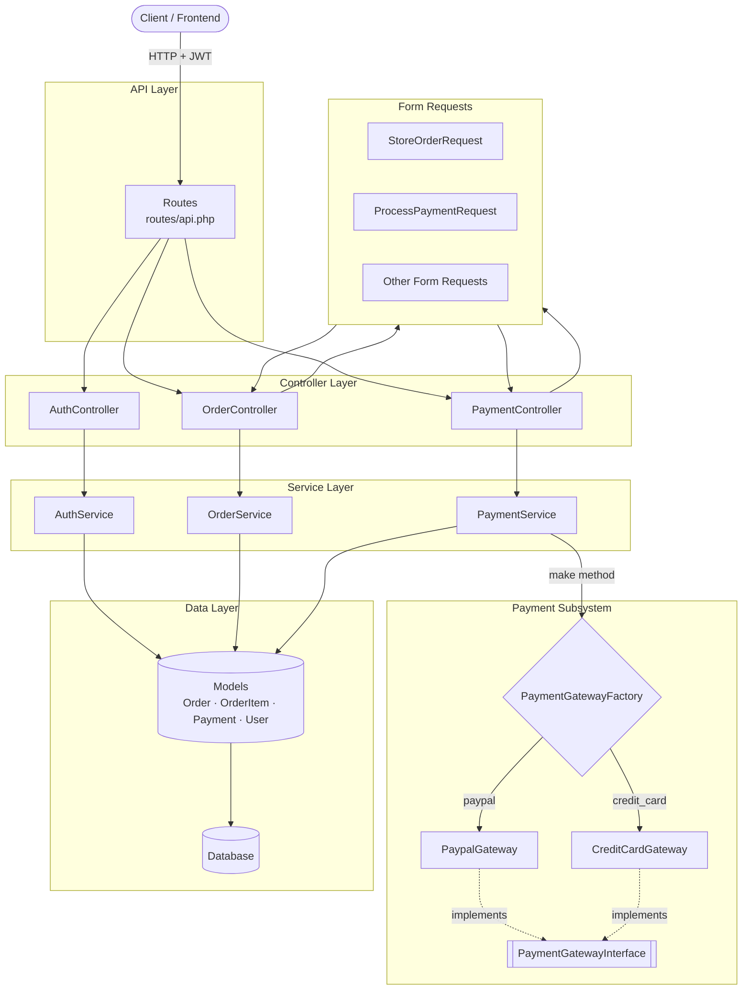

# Order & Payment Management API

[](https://laravel.com)
[](https://php.net)
[](https://github.com/tymondesigns/jwt-auth)
[](#testing-summary)
[](LICENSE)

A production-ready **Laravel 12 REST API** for managing customer **Orders** and processing **Payments** through a pluggable, multi-gateway architecture. Built around clean architectural principles — **Service Layer**, **Strategy Pattern**, and **Factory Pattern** — the codebase is engineered for extensibility, testability, and long-term maintainability.

---

## Overview

This project delivers a secure, well-structured backend for an e-commerce-style order and payment workflow. It exposes a JSON REST API protected by **JWT (JSON Web Token)** authentication and follows **SOLID** design principles throughout.

### Core Capabilities

- **Laravel REST API** — A clean, resource-oriented HTTP API with a consistent JSON envelope (`success`, `message`, `data`) across every endpoint.
- **JWT Authentication** — Stateless token-based authentication via `tymon/jwt-auth`, supporting registration, login, profile retrieval, logout (token blacklisting), and token refresh.
- **Order Management** — Full CRUD for orders and their line items, with server-side total calculation, status filtering, and pagination. Every write operation is wrapped in a **database transaction**.
- **Payment Processing** — A gateway-driven payment module that routes each request to the correct provider through a **Strategy Pattern** (gateways) and a **Factory Pattern** (resolver). New payment providers can be added with **zero changes** to controllers, services, or routes.
- **Strategy Pattern** — Each payment gateway (`PaypalGateway`, `CreditCardGateway`) implements a shared `PaymentGatewayInterface` contract, making them interchangeable and individually testable.
- **Factory Pattern** — `PaymentGatewayFactory` resolves a `PaymentMethod` enum to the correct gateway instance, decoupling the caller from concrete implementations.
- **Clean Architecture** — Strict separation of concerns: **Controllers** handle HTTP, **Form Requests** handle validation & authorization, **Services** hold business logic, and **API Resources** shape the output.
- **SOLID Principles** — Single Responsibility (one class, one job), Open/Closed (extend gateways without modifying callers), Liskov Substitution (gateways are interchangeable via the contract), Interface Segregation (thin contracts), and Dependency Inversion (services depend on abstractions).

---

## Features

### Authentication
- **Register** — Create a new account and receive a JWT token.
- **Login** — Authenticate with email/password and receive a JWT token.
- **Logout** — Invalidate (blacklist) the current token.
- **Refresh Token** — Exchange a valid token for a fresh one.
- **User Profile** — Retrieve the authenticated user's details.

### Orders
- **Create** — Create an order with one or more line items (total auto-calculated server-side).
- **Update** — Partially update order fields and/or replace items.
- **Delete** — Delete an order (blocked if it has associated payments).
- **List** — Paginated list of the authenticated user's orders.
- **Filter** — Filter orders by `status` (`pending`, `confirmed`, `cancelled`).
- **Pagination** — Configurable `per_page` and `page`.

### Payments
- **Process Payment** — Charge a *confirmed* order via a chosen gateway (simulated).
- **View Payments** — List and show payments (scoped to the authenticated user).
- **Payment Simulation** — Gateways simulate realistic success/failure rates (PayPal 90%, Credit Card 85%).

### Architecture
- **Service Layer** — Business logic isolated from the HTTP layer.
- **Form Requests** — Typed, reusable request validation.
- **API Resources** — Consistent, decoupled response shaping.
- **Strategy Pattern** — Interchangeable payment gateways.
- **Factory Pattern** — Centralized gateway resolution.
- **Enums** — Type-safe status and method values.
- **Transactions** — Atomic multi-row writes.

### Testing
- **Feature Tests** — End-to-end HTTP tests covering all endpoints, validation, auth, and business rules.
- **Unit Tests** — Isolated tests for gateways and the factory.

---

## Architecture Diagram



> **Key insight:** `PaymentService` depends only on `PaymentGatewayFactory` and `PaymentGatewayInterface` — never on a concrete gateway. This is what makes adding a new provider (e.g. Stripe) a purely additive change.

---

## Project Structure

```
order-payment-api/
├── app/
│   ├── Contracts/
│   │   └── PaymentGatewayInterface.php      # Shared contract for all gateways
│   ├── Enums/
│   │   ├── OrderStatus.php                  # pending · confirmed · cancelled
│   │   ├── PaymentMethod.php                # credit_card · paypal
│   │   └── PaymentStatus.php                # pending · successful · failed
│   ├── Http/
│   │   ├── Controllers/
│   │   │   ├── BaseApiController.php        # Unified JSON response envelope
│   │   │   ├── AuthController.php           # register · login · me · logout · refresh
│   │   │   ├── OrderController.php          # Order CRUD
│   │   │   └── PaymentController.php        # Payment list · process · show
│   │   ├── Requests/
│   │   │   ├── RegisterRequest.php
│   │   │   ├── LoginRequest.php
│   │   │   ├── StoreOrderRequest.php
│   │   │   ├── UpdateOrderRequest.php
│   │   │   ├── IndexOrderRequest.php
│   │   │   ├── ProcessPaymentRequest.php
│   │   │   └── IndexPaymentRequest.php
│   │   └── Resources/
│   │       ├── UserResource.php
│   │       ├── OrderResource.php
│   │       ├── OrderItemResource.php
│   │       └── PaymentResource.php
│   ├── Models/
│   │   ├── User.php                         # JWTSubject
│   │   ├── Order.php
│   │   ├── OrderItem.php
│   │   └── Payment.php
│   ├── Services/
│   │   ├── AuthService.php
│   │   ├── OrderService.php
│   │   └── Payment/
│   │       ├── PaymentService.php
│   │       ├── PaymentGatewayFactory.php    # Factory Pattern
│   │       └── Gateways/
│   │           ├── PaypalGateway.php        # Strategy Pattern
│   │           └── CreditCardGateway.php    # Strategy Pattern
│   └── Providers/
│       └── AppServiceProvider.php
├── bootstrap/
│   └── app.php                              # Exception → JSON rendering
├── config/
│   ├── auth.php                             # JWT guard registered
│   └── jwt.php                              # tymon/jwt-auth config
├── database/
│   ├── factories/                           # User · Order · OrderItem · Payment
│   ├── migrations/                          # users · orders · order_items · payments
│   └── seeders/
│       ├── DatabaseSeeder.php
│       └── OrderSeeder.php                  # Sample orders + payment
├── routes/
│   └── api.php                              # All API routes
├── tests/
│   ├── Feature/                             # 61 end-to-end HTTP tests
│   │   ├── Auth/                            # Register · Login · Profile · AuthProtection
│   │   ├── Order/                           # CRUD · Validation · Filter · Delete · Total
│   │   └── Payment/                         # Process · Access · List · Validation
│   └── Unit/                                # 18 unit tests
│       └── Payment/                         # Factory · PaypalGateway · CreditCardGateway
├── .env.example
├── composer.json
├── phpunit.xml
└── README.md
```

---

## Installation

### Prerequisites

- **PHP ≥ 8.2** with the required Laravel extensions (mbstring, openssl, pdo, tokenizer, xml, ctype, json, bcmath)
- **Composer**
- A supported database (SQLite works out-of-the-box for local development; MySQL/PostgreSQL recommended for production)

### Steps

```bash
# 1. Clone the repository
git clone https://github.com/your-username/order-payment-api.git
cd order-payment-api

# 2. Install PHP dependencies
composer install

# 3. Copy the environment file
cp .env.example .env

# 4. Generate the application key
php artisan key:generate

# 5. Generate the JWT secret
php artisan jwt:secret

# 6. Configure your database in .env
#    (SQLite requires no extra config; for MySQL/PostgreSQL update DB_* values)
#
#    DB_CONNECTION=mysql
#    DB_HOST=127.0.0.1
#    DB_PORT=3306
#    DB_DATABASE=order_payment_api
#    DB_USERNAME=root
#    DB_PASSWORD=your_password

# 7. Run migrations and seed the database with sample data
php artisan migrate:fresh --seed

# 8. Start the development server
php artisan serve
```

The API will now be available at **`http://localhost:8000/api`**.

> **Tip:** The default seeder creates a test user (`test@example.com` / `password123`) with three sample orders.

---

## Running Tests

The project ships with a comprehensive test suite. To run all tests:

```bash
php artisan test
```

To run a specific suite:

```bash
# Feature tests only
php artisan test --testsuite=Feature

# Unit tests only
php artisan test --testsuite=Unit
```

With PHPUnit directly:

```bash
vendor/bin/phpunit
```

---

## API Authentication

This API uses **JWT (JSON Web Tokens)** for stateless authentication, provided by the [`tymon/jwt-auth`](https://github.com/tymondesigns/jwt-auth) package.

### How it works

1. The client authenticates via `POST /api/login` (or `POST /api/register`) and receives a signed `token`.
2. The client includes this token in the `Authorization` header of every subsequent request.
3. The `auth:jwt` middleware guard verifies the token on all protected routes.
4. `POST /api/logout` blacklists the token so it can no longer be used.
5. `POST /api/refresh` issues a new token before the current one expires.

### Authorization header

All protected endpoints require a **Bearer** token:

```
Authorization: Bearer <your-jwt-token>
Accept: application/json
```

---

## API Endpoints

### Authentication

| Method | Endpoint              | Description                  | Auth Required |
| :----: | --------------------- | ---------------------------- | :-----------: |
| `POST` | `/api/register`       | Register a new user          |      ❌       |
| `POST` | `/api/login`          | Authenticate and get a token |      ❌       |
| `GET`  | `/api/me`             | Get authenticated user       |      ✅       |
| `POST` | `/api/logout`         | Invalidate the current token |      ✅       |
| `POST` | `/api/refresh`        | Refresh the current token    |      ✅       |

### Orders

| Method   | Endpoint              | Description                                            | Auth Required |
| :------: | --------------------- | ------------------------------------------------------ | :-----------: |
| `GET`    | `/api/orders`         | List orders (paginated, filterable by `status`)        |      ✅       |
| `POST`   | `/api/orders`         | Create a new order with items                          |      ✅       |
| `GET`    | `/api/orders/{id}`    | Show a single order                                    |      ✅       |
| `PUT`    | `/api/orders/{id}`    | Update an order (fields and/or items)                  |      ✅       |
| `DELETE` | `/api/orders/{id}`    | Delete an order (blocked if payments exist → `409`)    |      ✅       |

**Order filters / pagination query parameters:**

| Parameter   | Type    | Description                                     |
| ----------- | ------- | ----------------------------------------------- |
| `status`    | string  | `pending` · `confirmed` · `cancelled`           |
| `per_page`  | integer | Items per page (`1`–`100`, default `15`)        |
| `page`      | integer | Page number                                     |

### Payments

| Method  | Endpoint                     | Description                                             | Auth Required |
| :-----: | ---------------------------- | ------------------------------------------------------- | :-----------: |
| `GET`   | `/api/payments`              | List payments (paginated, user-scoped)                  |      ✅       |
| `POST`  | `/api/payments`              | Process a payment for a *confirmed* order               |      ✅       |
| `GET`   | `/api/payments/{id}`         | Show a single payment                                   |      ✅       |
| `GET`   | `/api/orders/{order}/payments` | List all payments for a specific order                |      ✅       |

**Payment pagination query parameters:**

| Parameter   | Type    | Description                              |
| ----------- | ------- | ---------------------------------------- |
| `per_page`  | integer | Items per page (`1`–`100`, default `15`) |
| `page`      | integer | Page number                              |

---

## Sample Requests

### Register

```http
POST /api/register
Content-Type: application/json

{
  "name": "John Doe",
  "email": "john@example.com",
  "password": "password123",
  "password_confirmation": "password123"
}
```

### Login

```http
POST /api/login
Content-Type: application/json

{
  "email": "john@example.com",
  "password": "password123"
}
```

### Create Order

```http
POST /api/orders
Authorization: Bearer {{token}}
Content-Type: application/json

{
  "customer_name": "John Doe",
  "customer_email": "john@example.com",
  "status": "confirmed",
  "items": [
    {
      "product_name": "Wireless Headphones",
      "quantity": 2,
      "price": 59.99
    },
    {
      "product_name": "USB-C Cable",
      "quantity": 3,
      "price": 12.99
    }
  ]
}
```

### Process Payment

```http
POST /api/payments
Authorization: Bearer {{token}}
Content-Type: application/json

{
  "order_id": 1,
  "payment_method": "paypal"
}
```

---

## Sample Responses

All responses use a consistent JSON envelope:

```json
{
  "success": true,
  "message": "Human-readable message",
  "data": { ... }
}
```

### ✅ Success — `200 OK`

```json
{
  "success": true,
  "message": "Order retrieved successfully",
  "data": {
    "id": 1,
    "customer_name": "John Doe",
    "customer_email": "john@example.com",
    "status": "confirmed",
    "total": "156.95",
    "items": [
      {
        "id": 1,
        "product_name": "Wireless Headphones",
        "quantity": 2,
        "price": "59.99",
        "subtotal": "119.98"
      }
    ],
    "payments_count": 1,
    "created_at": "2026-06-24T10:00:00+00:00",
    "updated_at": "2026-06-24T10:00:00+00:00"
  }
}
```

### ✅ Created — `201 Created`

```json
{
  "success": true,
  "message": "Payment processed successfully",
  "data": {
    "id": 5,
    "payment_id": "pay_a1b2c3d4-e5f6-7890-abcd-ef1234567890",
    "order_id": 1,
    "payment_method": "paypal",
    "status": "successful",
    "amount": "156.95",
    "gateway_response": {
      "transaction_id": "pp_09876543-21fe-dcba-0987-6543210fedcba",
      "message": "PayPal payment processed successfully."
    },
    "created_at": "2026-06-24T10:05:00+00:00"
  }
}
```

### ❌ Validation Error — `422 Unprocessable Entity`

```json
{
  "success": false,
  "message": "Validation failed",
  "errors": {
    "customer_email": [
      "The customer email must be a valid email address."
    ],
    "items": [
      "The order must contain at least one item."
    ]
  }
}
```

### ❌ Unauthorized — `401 Unauthorized`

```json
{
  "success": false,
  "message": "Unauthenticated. Please provide a valid token."
}
```

### ❌ Business Rule Error — `422 Unprocessable Entity`

```json
{
  "success": false,
  "message": "Payments can only be processed for confirmed orders."
}
```

### ❌ Not Found — `404 Not Found`

```json
{
  "success": false,
  "message": "The requested resource was not found."
}
```

### ❌ Conflict — `409 Conflict`

```json
{
  "success": false,
  "message": "Order cannot be deleted because it has associated payments."
}
```

---

## Payment Gateway Extensibility

The payment subsystem is designed around the **Open/Closed Principle** — open for extension, closed for modification. Adding a new gateway such as **Stripe** is a purely additive change.

### Adding Stripe in 3 steps

#### Step 1 — Add a new enum case

Edit `app/Enums/PaymentMethod.php` and add the `Stripe` case:

```php
<?php

namespace App\Enums;

enum PaymentMethod: string
{
    case CreditCard = 'credit_card';
    case PayPal = 'paypal';
    case Stripe = 'stripe';   // 👈 new case
}
```

#### Step 2 — Create the Stripe gateway

Create `app/Services/Payment/Gateways/StripeGateway.php` implementing the existing contract:

```php
<?php

namespace App\Services\Payment\Gateways;

use App\Contracts\PaymentGatewayInterface;
use App\Enums\PaymentStatus;
use App\Models\Order;
use Illuminate\Support\Str;

class StripeGateway implements PaymentGatewayInterface
{
    public function pay(Order $order): array
    {
        // Simulate ~95% success
        $isSuccessful = random_int(1, 100) <= 95;

        if ($isSuccessful) {
            return [
                'status' => PaymentStatus::Successful,
                'gateway_response' => [
                    'transaction_id' => 'stripe_' . Str::uuid()->toString(),
                    'message' => 'Stripe payment processed successfully.',
                ],
            ];
        }

        return [
            'status' => PaymentStatus::Failed,
            'gateway_response' => [
                'message' => 'Stripe payment was declined.',
            ],
        ];
    }
}
```

#### Step 3 — Register Stripe in the factory

Add one match arm to `PaymentGatewayFactory::make()` in `app/Services/Payment/PaymentGatewayFactory.php`:

```php
return match ($method) {
    PaymentMethod::PayPal     => new PaypalGateway(),
    PaymentMethod::CreditCard => new CreditCardGateway(),
    PaymentMethod::Stripe     => new StripeGateway(),   // 👈 new arm
};
```

### Why no other changes are required

Because the entire payment flow is built on abstractions, the three steps above are **sufficient**. The following require **no changes whatsoever**:

| Component            | Why it's untouched                                                                     |
| -------------------- | -------------------------------------------------------------------------------------- |
| `PaymentController`  | It delegates to `PaymentService` and never names a concrete gateway.                   |
| `PaymentService`     | It resolves the gateway through `PaymentGatewayFactory::make()` using the enum.        |
| **Routes**           | The `POST /api/payments` route is already in place.                                    |
| **Business Rules**   | The "confirmed order only" rule is method-agnostic; it applies to any gateway.         |

> **Note on validation:** The `payment_method` field in `ProcessPaymentRequest` uses an `in:credit_card,paypal` rule. To accept the new `stripe` value over the API, append it to that rule (`in:credit_card,paypal,stripe`). This is a one-line validation update — no logic, services, or controllers change.

### How this satisfies the Open/Closed Principle (OCP)

The Open/Closed Principle states that software entities should be **open for extension** but **closed for modification**. This payment design satisfies OCP because:

1. **Extension is additive** — A new gateway is added by introducing a *new* class (`StripeGateway`) and a *new* enum case. Nothing existing is rewritten.
2. **No modification to callers** — `PaymentService` depends on the `PaymentGatewayInterface` contract, not on any concrete gateway. It is completely unaware of which gateways exist.
3. **Single registration point** — The only place that knows about concrete gateways is the factory, and even there the change is appending a match arm, not altering existing behavior.
4. **Polymorphism over conditionals** — Because all gateways share the same interface, the service calls `$gateway->pay($order)` uniformly. No `if/switch` sprawls through the codebase.

The result: adding Stripe does not risk breaking PayPal or Credit Card, requires no new tests for existing gateways, and cannot introduce regressions in the service or controller layers.

---

## Testing Summary

The project is fully tested. Every endpoint, validation rule, business rule, and architectural component is covered.

| Suite   | Tests | Assertions | Status |
| ------- | :---: | :--------: | :----: |
| Feature |  61   |    276     |  ✅    |
| Unit    |  18   |     39     |  ✅    |
| **Total** | **79** | **315** | **✅ All passing** |

### Feature Test Coverage

- **Auth** — Registration, login, profile, token refresh, logout/blacklisting, and route protection (401 on all guarded endpoints without a token).
- **Orders** — CRUD operations, validation (all fields, nested items), status filtering, pagination, total calculation (incl. rejecting client-supplied totals), and the delete-with-payments conflict rule.
- **Payments** — Processing on confirmed/pending/cancelled orders, amount integrity, multi-tenancy scoping (users cannot access each other's resources), pagination, and validation.

### Unit Test Coverage

- **PaymentGatewayFactory** — Correct gateway resolution per enum case, contract compliance, and `InvalidArgumentException` for unsupported methods.
- **PaypalGateway / CreditCardGateway** — Response shape, `PaymentStatus` enum compliance, transaction-ID prefixes, and success/failure message contracts.

Run the full suite with:

```bash
php artisan test
# Tests: 79 passed (315 assertions)
```

---

## Design Decisions

| Decision | Rationale |
| -------- | --------- |
| **Service Layer** | Keeps controllers thin and HTTP-focused. All business rules (total calculation, payment scoping, transaction wrapping) live in testable service classes, separate from the request/response cycle. |
| **API Resources** | Provides a single, stable transformation layer between Eloquent models and JSON output. Internal schema changes don't leak into the API contract, and sensitive fields (e.g. `password`) are never serialized. |
| **Form Requests** | Centralizes validation rules and custom messages per action. Controllers stay clean, rules are reusable, and authorization is explicit and isolated. |
| **Database Transactions** | Order creation/update involves multiple related writes (order + items + total). Wrapping them in `\DB::transaction()` guarantees atomicity — a failure rolls everything back, preventing partial/corrupt records. |
| **Enums** | PHP 8.1 backed enums (`OrderStatus`, `PaymentMethod`, `PaymentStatus`) replace magic strings with type-safe, self-documenting values, eliminating typos and enabling exhaustive `match` expressions. |
| **Strategy Pattern** | Each payment gateway encapsulates its own logic behind a shared interface. Gateways are interchangeable, individually testable, and can be selected at runtime based on the request. |
| **Factory Pattern** | `PaymentGatewayFactory` centralizes the mapping from `PaymentMethod` to concrete gateway, decoupling the service from object construction and making the system trivially extensible (see [Payment Gateway Extensibility](#payment-gateway-extensibility)). |

---

## Future Improvements

The current implementation is a solid, production-shaped foundation. Recommended next steps:

- **Stripe Gateway** — Add real Stripe integration following the extensibility guide above.
- **Webhook Support** — Receive asynchronous status updates from payment providers (success, refund, chargeback) via signed webhooks.
- **Async Queue Processing** — Offload gateway calls to queued jobs for non-blocking payments and retries.
- **Real Payment Integration** — Swap simulated gateways for live SDK calls (PayPal REST API, Stripe Charge/PaymentIntent).
- **Caching** — Cache read-heavy endpoints (e.g. order lists, reference data) with Redis to reduce database load.
- **API Versioning** — Introduce `/api/v1` prefixing to evolve the contract safely without breaking existing clients.
- **Rate Limiting** — Apply throttling (`throttle` middleware) to auth and payment endpoints to mitigate abuse.
- **Role-Based Authorization** — Add roles/permissions (admin, customer, manager) using gates/policies for finer-grained access control.
- **Audit Logs** — Track who did what and when for orders and payments (important for compliance and dispute resolution).
- **Docker Deployment** — Containerize the app with multi-stage Dockerfiles and `docker-compose` for consistent environments.
- **CI/CD** — Automate testing, linting (Pint), and deployment via GitHub Actions for every push/PR.

---

## License

This project is open-sourced software licensed under the [MIT license](https://opensource.org/licenses/MIT).
